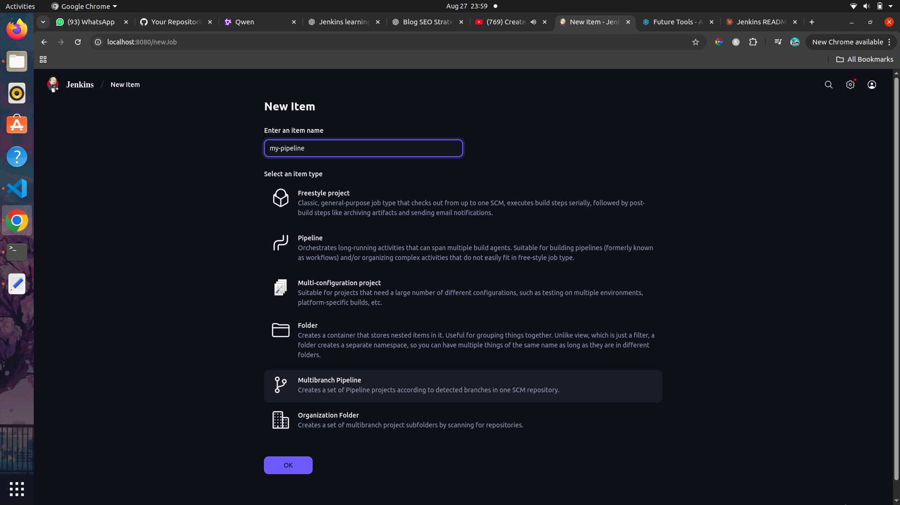

# Day 2: Create Multibranch Pipeline with Git

Today we will learn how to create **Jenkins Multibranch Pipelines** with your git repo.
By the end, you’ll know how Jenkins scans your repo, builds from different branches, and how to keep things secure with proper credential scopes.

## Prerequisites

- Jenkins running locally (see Day 1 setup with Docker)

- A Git repository with at least 2–3 branches (main, dev, maybe feature-login)

- Basic familiarity with Jenkins UI

## Multibranch Pipeline

- This pipeline is set up so that jenkins can scan through multiple branches at the same time.
- So instead of creating seperate pipelines for seperate branches, it is easier to create a single multibranch pipeline for that project.
- It can also be used to discard any branches that doesnt need scanning.

## Setting up a Multibranch Pipeline

1. In Jenkins dashboard, click **New Item**
   
2. You will be able to see many options in it, we will discuss about it later in the upcoming days.
   But for now lets select **"Multibranch Pipeline"** and enter the project name(eq.**my-pipeline**)
   
