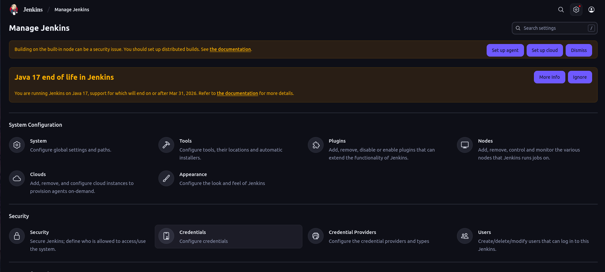
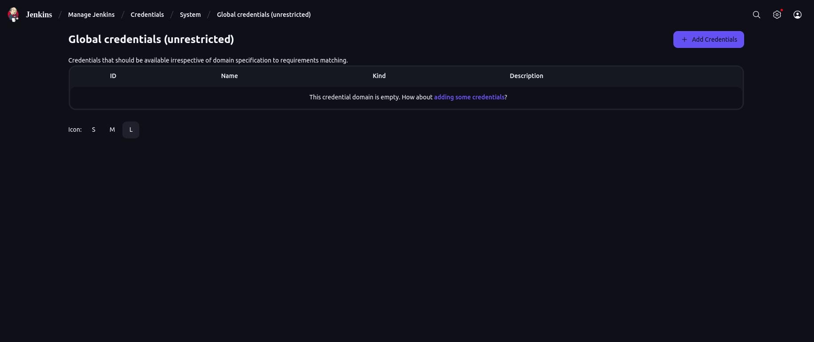
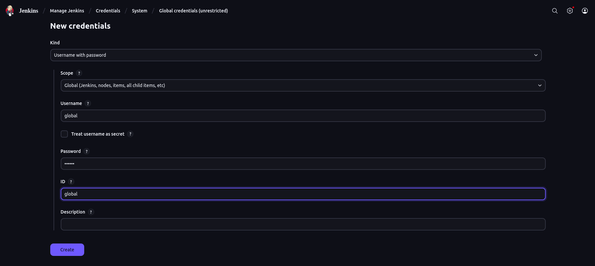
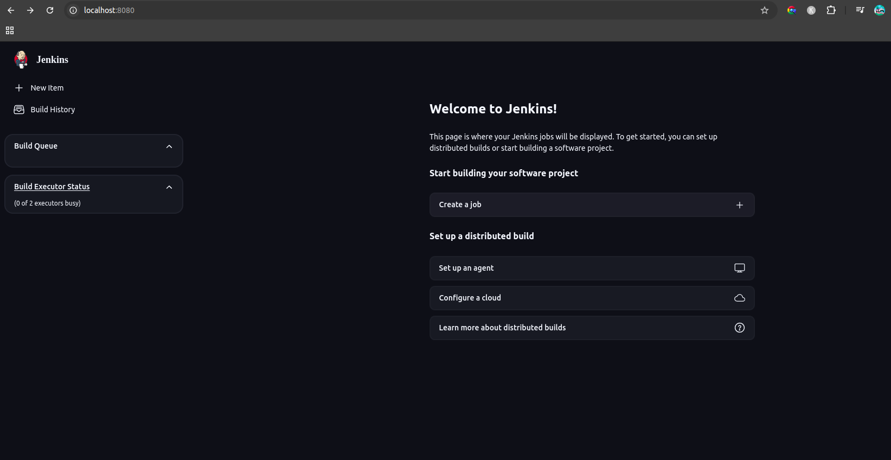
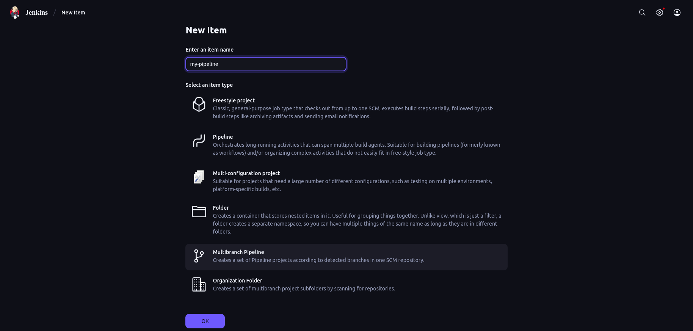
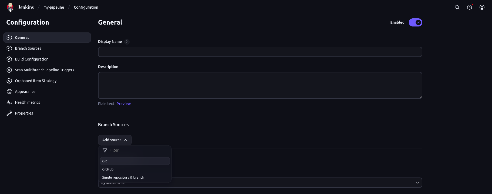

# Day 2: Create Multibranch Pipeline with Git

Today we will learn how to create **Jenkins Multibranch Pipelines** with your git repo.
By the end, you’ll know how Jenkins scans your repo, builds from different branches, and how to keep things secure with proper credential scopes.

## Prerequisites

- Jenkins running locally (see Day 1 setup with Docker)

- A Git repository with at least 2–3 branches (main, dev, maybe feature-login)

- Basic familiarity with Jenkins UI

## Multibranch Pipeline

- This pipeline is set up so that jenkins can scan through multiple branches at the same time.
- So instead of creating seperate pipelines for seperate branches, it is easier to create a single multibranch pipeline for that project.
- It can also be used to discard any branches that doesnt need scanning.

## Step 1: Understanding Jenkins Credentials

- Jenkins Provide three types of credential scopes

1. System Credentials:
   - These are credentials that is not accesible by build jobs or pipelines
   - These Credentials will not be shown in jenkins while we try to create pipelines
   - These are just used or available only for ssh purposes and nothing else.
   - Rest of the credentials below are what will be used for build jobs and pipelines
2. Global Credentials:
   - These are the credentials entirely opposite to System Credentials
   - These are accessible from anywhere for build jobs or pipelines
   - Use this credential when multiple projects need it
3. Folder/Project Credentials:
   - These are credentials that is tied to that particular folder or project
   - This credential is not visible to other projects or folders
   - Use this credential if it is used just for that one pipeline

## Step 2: Add Git Credentials

- You can add two credentials(Global and system if required). But for the convenience, lets create a global credential

1. In jenkins dashboard, click **manage jenkins**. Click on Credentials
   
2. Click on the options that you get till you see this image(you can see the locations that we have gone at the top)
   Click on Add Credentials and select **Global** as scope
   
3. Fill out the fields in this format:

- Type: Username with password
- Username = global
- Password/Token = password
- ID = global
  

4. Now you can see a new **global credential** with the id **global** has been created. This credential is required for setting up **Multibranch Pipeline**

## Step 3: Create a new Multibranch Pipeline

1. In Jenkins dashboard, click **New Item**
   
2. You will be able to see many options in it, we will discuss about it later in the upcoming days.
   But for now lets select **"Multibranch Pipeline"** and enter the project name(eq.**my-pipeline**) and then click ok
   

## Step 4: Configure Branch source

1. In the Branch Sources section, click "Add source" → "Git"
2. Enter your Git repository URL
3. In the credentials section, add the global credential that we have created
   

## Step 4: Control Which Branches get built

By default, Jenkins will try to build everthing. So use branch filtering in that case

1. Under Credentials section, You can see a section named **Behaviours**, click on the **Add** option below it
2. Choose Filter by name(with regular expression) option. The default option will select every branches, so you can select branches that need to be excluded or not
   
3. Now click on save and Jenkins will immediately scan your repo

## Note

- Each branch needs a **Jenkinsfile** in root, or it won't build
- We will learn about it in the upcoming days. This was just created to make you understand about **Multibranch Pipeline** and how it is set up
