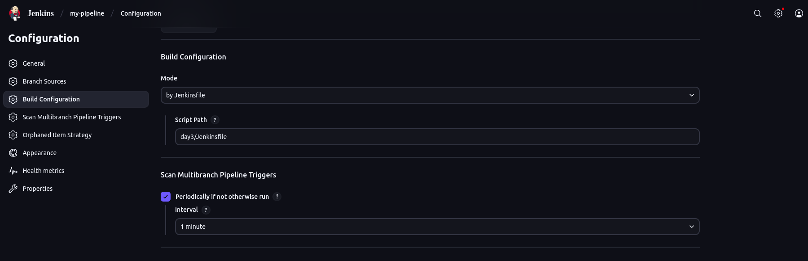
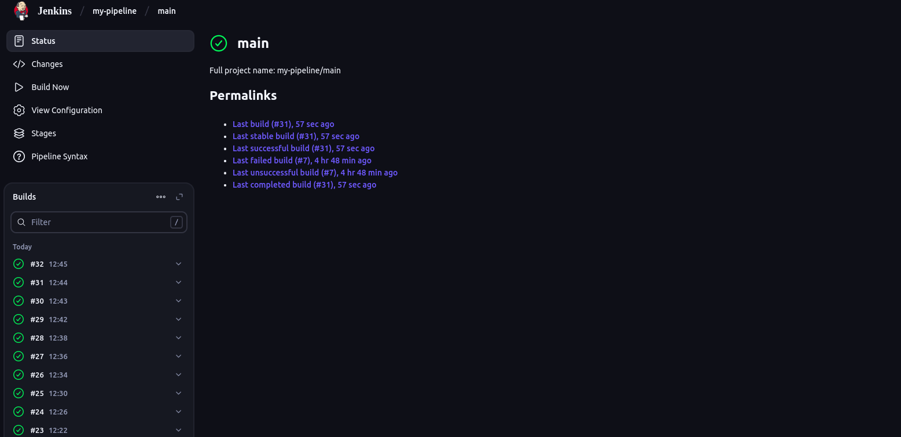
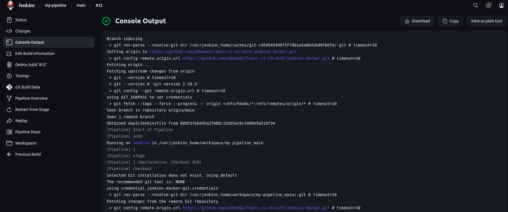
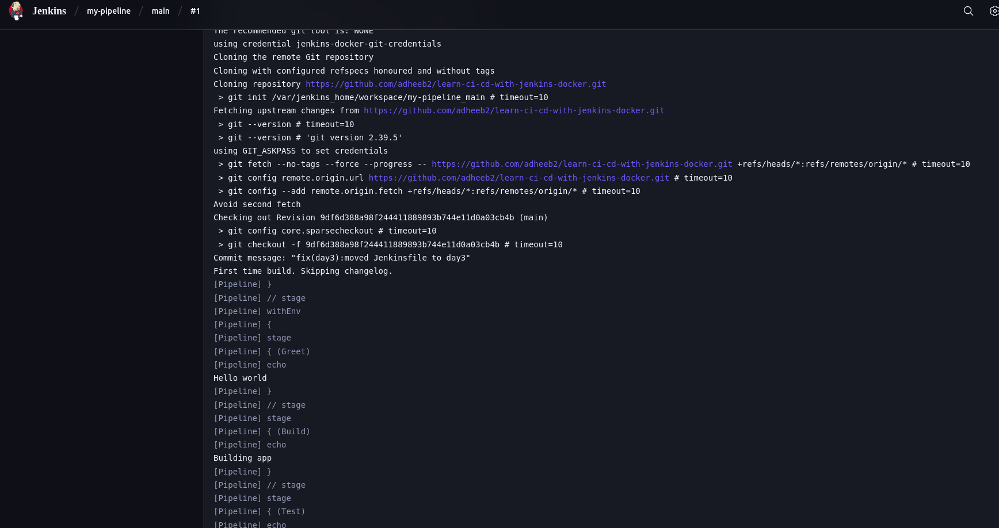

# Day 3: Automating Jenkins Builds with Ngrok, GitHub Webhooks & Jenkinsfile

Today we will learn how to write **JenkinsFile** and **automate Jenkins builds** using **Ngrok** and **GitHub Webhooks**, instead of manually clicking “Build Now”.
By the end, you’ll understand how Ngrok exposes your local Jenkins, how GitHub webhooks notify Jenkins, and how Jenkinsfile defines your pipeline.

## Prerequisites

- Jenkins running locally (see Day 1 setup with Docker)

- A GitHub repository connected to Jenkins

- Ngrok installed and configured

- A basic Jenkins Multibranch Pipeline created (see Day 2)

## Step 1: Understanding Ngrok

- The laptop is running Jenkins on http://localhost:8080.
- GitHub needs a way to notify Jenkins about code changes, but Jenkins on localhost:8080 is only accessible to us locally and not from the internet.
- In that case, we will use something known as **Ngrok**
- It is a tool that creates temporary public URL for our local Jenkins
- With this URL, we can connect github to Jenkins
- You can install ngrok by visiting this doc below:
  <a href = https://dashboard.ngrok.com/get-started/setup/linux>Ngrok</a>
- Follow the docs and run **ngrok http 8080**. This would provide you with **Ngrok URL** .

## Step 2: Setting up Github Webhook

- A GitHub webhook is a way for GitHub to notify Jenkins whenever you push code.
- We can set up Github Webhook like this:

  1. Go to your GitHub repository → Settings → Webhooks.

  2. Click Add Webhook.

  3. Enter your Ngrok URL with /github-webhook/ at the end:

  ```

  https://random-id.ngrok-free.app/github-webhook/

  ```

  4. Make sure the **content type** is application/json
  5. Select **Just the push event** and save it

- Now, every time you push code → GitHub sends a JSON message to Jenkins.

## Step 3: Setting up JenkinsFile

- A Jenkinsfile is just a plain text file where you write down the instructions for Jenkins on how to build, test, and deploy your project.

- It is written in Groovy-based DSL (Domain Specific Language)

- There are two syntaxes for JenkinsFile

  1. Declarative Syntax(easier and most recommended for beginners)
  2. Scripted Syntax(difficult and less common for basic setups)

- Syntax of JenkinsFile:

```
pipeline {
    agent any
    stages {
        stage('Build') {
            steps {
                echo 'Building...'
            }
        }
        stage('Test') {
            steps {
                echo 'Testing...'
            }
        }
        stage('Deploy') {
            steps {
                echo 'Deploying...'
            }
        }
    }
}
```

- pipeline{} - The entire thing lives inside this
- agent - Defines where to run the pipeline.

  1. agent any → run on any available machine.

  2. agent none → don’t run automatically, you’ll define specific agents per stage.

- stages{} - Collection of different steps in the CI/CD
- stage('Name'){} - Each step names. For eg: stage('Build') represents to us that this step is used for install dependencies.
- steps{} - The actual commands run inside this. For eg: echo 'Building'

- You can either place JenkinsFile in root, this makes it easier for jenkins to scan it.
- Or you can keep it in a folder. But make sure to specify the path in the 'build configuration' part of Configuration in your multibranch pipeline
  

## Step 4: Connecting webhook to jenkins

- In Jenkins, go to your Multibranch Pipeline job
- Then in configuration, go on to the 'build configuration' section where you can find **Scan Multibranch Pipeline Triggers**(check the above image to understand)
- Under that, you will find **Periodically if not otherwise run**. Tick that option and give '1 minute' as interval.

## Step 5: Testing the Setup

- Run ngrok http 8080 and keep it running

- Push a commit to your GitHub repo

- Check Jenkins:

- It should detect the webhook trigger

- Your Jenkinsfile stages (Build, Test, Deploy) should run automatically

- No need to click **Build Now** manually

- Check it on **Console Output** section to check whether the build has failed or not(click on the #number on left side under the Builds section)
  

  

  
